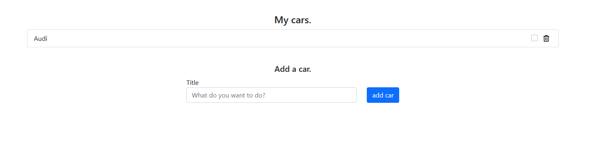
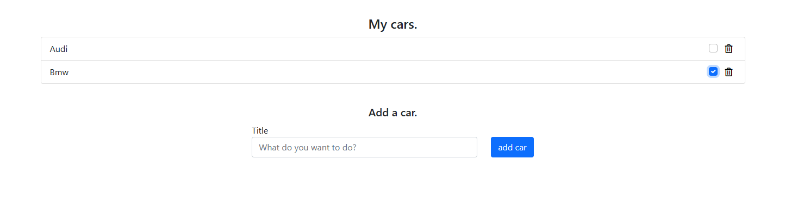
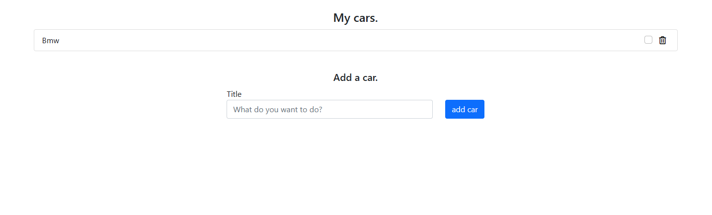

 <h1> Proiect Tehnologii web</h1>

<h3> Obiectiv </h3>

Realizarea unei aplicatii web care sa permita adaugarea/ stergerea si bifarea spre vanzare a unei masini in baza de date a unei companii care se ocupa cu vanzarea acestora.

Această aplicație respectă operațiunile CRUD, cum ar fi:  
 
Creare - adăugarea unei masini. 

Citire - vizualizarea elementeleor din lista de masini. 
Actualizare - actualizarea listei de masini. 

Stergere - stergerea unei masini. 

